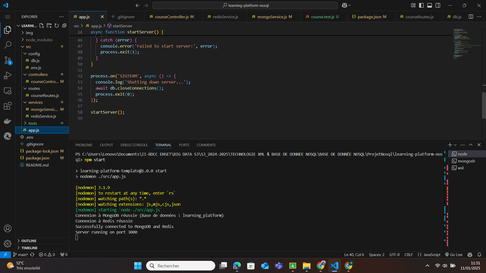

# Projet de fin de module NoSQL
## Réalisé par TANGARA YOUSSOUF

## Description
Ce projet a pour objectif de créer une API backend pour une plateforme d'apprentissage en ligne en utilisant une base de données NoSQL. L'API permet de gérer des cours, des utilisateurs, et d'autres fonctionnalités liées à la plateforme.  
L'accent est mis sur une organisation professionnelle du code, l'utilisation de bonnes pratiques et la gestion des données avec MongoDB et Redis.

### Fonctionnalités principales :
- Gestion des cours (CRUD).
- Utilisation d'une base de données MongoDB pour le stockage principal.
- Implémentation de Redis pour le caching ou d'autres besoins spécifiques.
- Gestion d'erreurs et documentation du code.

---

## Réponses aux questions posées dans le code

### Configuration des variables d'environnement fichier `.env`

#### Pourquoi utiliser des variables d'environnement ?
Les variables d'environnement permettent de gérer les informations sensibles et les configurations spécifiques à chaque environnement (développement, test, production) de manière sécurisée et flexible. Elles offrent plusieurs avantages :
- **Sécurité** : Empêchent l'exposition des informations sensibles dans le code source.
- **Flexibilité** : Permettent d'adapter les configurations sans modifier le code source.
- **Portabilité** : Facilitent le déploiement sur différents serveurs avec des configurations spécifiques.
- **Clarté** : Centralisent les configurations en un seul endroit, simplifiant ainsi la maintenance.

#### Quelles informations sensibles ne jamais commiter ?
Il est essentiel de ne pas inclure les éléments suivants dans le dépôt Git :
1. URI ou URL des bases de données (ex. : `MONGODB_URI`, `REDIS_URI`).
2. Clés d’API ou identifiants de services tiers.
3. Secrets ou clés privées pour des services comme JWT.
4. Ports ou configurations spécifiques à l'environnement.

### Fichier `.gitignore`

#### Pourquoi utiliser un fichier `.gitignore` ?
Le fichier `.gitignore` permet d'exclure certains fichiers ou dossiers du dépôt Git. Cela garantit que des fichiers sensibles ou inutiles pour le fonctionnement de l'application ne sont pas inclus dans le suivi de version.

#### Contenu du fichier `.gitignore`
Voici le contenu du fichier `.gitignore` utilisé dans ce projet : `node_modules/` et `.env` 

### Gestion des connexions aux bases de données `config/db.js`

#### Pourquoi créer un module séparé pour les connexions aux bases de données ?
Créer un module séparé pour gérer les connexions aux bases de données permet de centraliser la logique de connexion, de simplifier le code, et de rendre l'application plus modulaire. Cela permet également de faciliter la gestion des erreurs, des retries, et de maintenir une structure propre et réutilisable pour les connexions aux bases de données.

#### Comment gérer proprement la fermeture des connexions ?
Pour gérer proprement la fermeture des connexions, nous avons utilisé une fonction dédiée `closeConnections()`, qui ferme les connexions MongoDB et Redis lorsque l'application est arrêtée. Cette approche permet de s'assurer que toutes les connexions sont fermées proprement, ce qui évite les fuites de ressources et garantit la stabilité de l'application. Il est également important de gérer les erreurs lors de la fermeture pour s'assurer qu'aucun problème n'est ignoré.

### Fichier : `env.js`

Le fichier `env.js` charge et valide les variables d'environnement nécessaires pour que l'application fonctionne correctement. Ce fichier est crucial pour assurer la sécurité et la configuration de l'application, en validant les variables avant de démarrer le serveur.

#### Pourquoi est-il important de valider les variables d'environnement au démarrage ?
Il est important de valider les variables d'environnement au démarrage de l'application pour garantir que toutes les configurations nécessaires (comme les informations de connexion à la base de données et aux services externes) sont présentes. Si une variable essentielle est manquante, cela pourrait entraîner des erreurs inattendues durant l'exécution de l'application. La validation permet de détecter et de résoudre ces erreurs avant même de commencer à exécuter le code.

#### Que se passe-t-il si une variable requise est manquante ?
Si une variable requise est manquante, le programme lève une erreur explicite, ce qui empêche l'application de démarrer. Cela permet de signaler immédiatement les problèmes de configuration et d'empêcher le démarrage de l'application dans un état incorrect, réduisant ainsi les risques d'erreurs imprévues pendant l'exécution.

### Fichier : `env.js`

#### Comment organiser le point d'entrée de l'application ?
Le point d'entrée de l'application est le fichier `app.js`. Il est responsable de la création du serveur Express, de la gestion des middlewares, de la connexion aux bases de données et du démarrage du serveur. Ce fichier centralise également la gestion des routes et des erreurs, garantissant ainsi que toutes les configurations et les actions nécessaires au bon fonctionnement du serveur sont effectuées de manière cohérente.

#### Quelle est la meilleure façon de gérer le démarrage de l'application ?
La gestion du démarrage de l'application se fait via la fonction `startServer()`. Cette fonction :
1. Se charge de connecter aux bases de données via `connectDatabases()`.
2. Configure les routes de l'application.
3. Démarre le serveur Express une fois toutes les étapes de préparation effectuées.

Cette approche assure que l'application ne démarre que lorsque toutes les connexions nécessaires sont établies et que les routes sont correctement configurées. Si une erreur survient, elle est loggée et l'application s'arrête proprement, empêchant ainsi un démarrage incorrect.

### Capture d'ecran montrant que la connection à la base de données mongdb marche bien de même pour redis

### Fichier : `courseController.js`

#### Question : Quelle est la différence entre un contrôleur et une route ?
- Route : La route définit l'URL de la ressource ainsi que la méthode HTTP (GET, POST, PUT, DELETE, etc.) qui doit être utilisée pour interagir avec la ressource. Elle est responsable de l'écoute des requêtes envoyées par le client.
- Contrôleur : Le contrôleur est un fichier ou une fonction qui contient la logique nécessaire pour répondre aux requêtes envoyées par les routes. Il traite les données, interagit avec la base de données, applique des règles métiers, et renvoie la réponse appropriée au client. En somme, le contrôleur contient la logique métier qui est invoquée via les routes.

#### Question : Pourquoi séparer la logique métier des routes ?
Séparer la logique métier des routes permet de maintenir une architecture plus propre et modulaire. Cela présente plusieurs avantages :

- Lisibilité : La logique métier étant séparée, le fichier de la route reste simple et concis, facilitant sa lecture et sa compréhension.
- Réutilisabilité : Les contrôleurs peuvent être réutilisés dans plusieurs routes ou tests sans dupliquer le code.
- Testabilité : Tester la logique métier devient plus facile, car elle est séparée des préoccupations liées aux requêtes HTTP.
- Maintenance : Lorsque la logique métier est centralisée, toute modification peut être faite dans un seul endroit, simplifiant ainsi la maintenance.

---

### Fichier : `courseRoutes.js`

#### Pourquoi séparer les routes dans différents fichiers ?
Séparer les routes dans différents fichiers permet de maintenir une structure de code claire et modulaire. Chaque fichier peut être responsable d'un ensemble logique de routes (par exemple, un fichier pour les cours, un autre pour les utilisateurs). Cela améliore la lisibilité du code et facilite la maintenance. En cas de besoin d'ajouter ou de modifier des routes, on peut intervenir uniquement dans le fichier concerné, sans risquer de toucher à d'autres parties du projet.

#### Comment organiser les routes de manière cohérente ?
Les routes doivent être organisées selon les ressources qu'elles manipulent. Par exemple, dans le fichier `courseRoutes.js`, toutes les routes relatives aux cours (comme la création d'un cours, la récupération des détails d'un cours ou les statistiques) sont groupées. Il est aussi conseillé de suivre une convention de nommage cohérente pour les URL et de les organiser selon des groupes logiques. Cela permet de créer une structure uniforme et d'éviter des conflits entre les différentes routes de l'application.

### Fichier : `mongoServices.js`

#### Question: Pourquoi créer des services séparés ?
Réponse: Les services séparés permettent d'organiser la logique métier et les interactions avec la base de données de manière cohérente et modulaire. Ils facilitent la maintenance, les tests unitaires et le réemploi du code. Par exemple, les services MongoDB regroupent toutes les opérations sur la base de données, ce qui réduit la duplication et isole les détails d'implémentation.

### Fichier : `mongoServices.js`

#### Question : Comment gérer efficacement le cache avec Redis ?
Réponse :
 - Définir un TTL (Time-To-Live) approprié pour les clés en fonction de la fréquence de mise à jour des données.
 - Éviter de surcharger Redis avec des données volumineuses inutiles ou peu demandées.
 - Utiliser un mécanisme de mise à jour du cache (invalidation) lorsque les données sous-jacentes changent dans la base de données principale.
 - Superviser l'utilisation de Redis pour éviter une saturation mémoire (Redis est in-memory).
 
#### Question: Quelles sont les bonnes pratiques pour les clés Redis ?
 Réponse :
 - Utiliser des noms de clés clairs et structurés, par exemple, `app:module:resource:id`.
 - Éviter les noms génériques comme `data` ou `cache`.
 - Grouper les clés avec des préfixes pour faciliter la gestion et le nettoyage.
 - Toujours définir un TTL pour éviter l'accumulation de clés obsolètes.

---

# Gestion des Cours - Documentation de Test

Cette partie décrit le processus de test pour les fonctionnalités de gestion des cours. Un fichier de test nommé `coursetest.html` a été créé pour vérifier les opérations CRUD (Créer, Lire, Mettre à jour, Supprimer) pour l'entité cours.

## Aperçu test de mongoService.js avec course (controller et route)

Le fichier `coursetest.html` sert d'interface simple pour tester toutes les fonctionnalités liées à la gestion des cours. Le processus de test garantit que chaque opération fonctionne comme prévu et interagit correctement avec le back-end.

### Fonctionnalités testées

- **Création** : Ajouter un nouveau cours avec les champs nom et durée.
- **Lecture** : Récupérer et afficher tous les cours dans un format structuré.
- **Mise à jour** : Modifier les détails d'un cours existant par ID.
- **Suppression** : Supprimer un cours par ID.

### Voici la capture :

